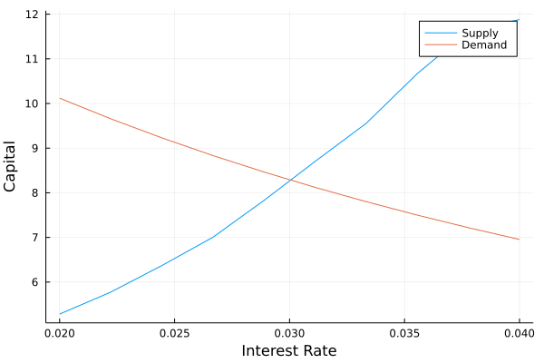

# Aiyagari Model

Consider a model with a continuum of infinitely lived, ex-ante identical agents that are subject to idiosyncratic income shocks that follow a Markov process. The problem of one of those agents is therefore:

$$\max_{\{c_t,a_{t+1}\}_{t=0}^{\infty}}\ \mathbb{E} \sum_{t=0}^{\infty} \beta^t u(c_t)$$

subject to:
$$a_{t+1} + c_{t} = w z_{t} + (1+r)a_{t}$$
The Bellman equation is then:

$$V(a,z) = \max_{a'}\bigg\{ u[w z+(1+r)a-a'] + \beta \sum_{z'} \pi_{z'|z} V(a',z')\bigg\}$$

We assume there is a large number of firms and that they are perfectly competitive. Firms hire labor and capital and employ a standard Cobb-Douglas production function. Then, firms solve the static problem:
$$\max_{K_t,N_t} A K_{t}^{\alpha} - (r+\delta)K_t - w$$

Notice that since households do not value leisure they supply $N_t=1$ inelastically. Demand for capital at a given interest rate is given by:
$$K_t(r_t) = \left( \frac{\alpha A}{r_t + \delta}\right)^{\frac{1}{1-\alpha}}$$
And the wage rate, again at a given interest rate is:
$$w_t(r_t) = A(1-\alpha)\left(\frac{A\alpha}{r_t+\delta}\right)^{\frac{\alpha}{1-\alpha}}$$

Therefore, an equilibrium is an interest rate $r_t$ such that:
- The policy function of the households solves the value function.
- Demand for capital satisfies the expression above.
- The wage level satisfies the expression above.
- Markets clear. Specifically, aggregate supply of capital by the households should be equal to the demand of capital by the firms (or representative firm).

With the solution to the value function for a number of different $r$ values, one can approximate the supply of capital as a function of interest rate. Then, one can graphically see the unique equilibrium in this setting:

