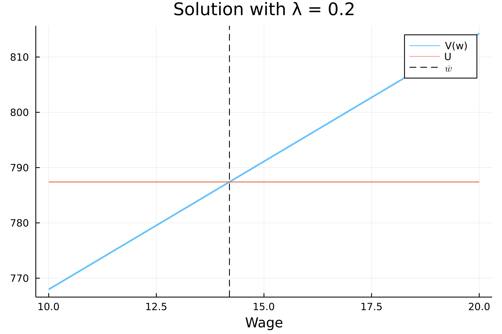

# McCall Model with Separation

Consider a model of unemployment search where:

- An unemployed worker receives a job offer with a wage  from a distribution with some density . Upon receiving the offer, the agent must decide between accepting and rejecting it. If the offer is accepted, the agent gets  in the current period and enters the next period employed with wage . If the offer is rejected, the agent collects  (home production or unemployment benefits) and waits until next period, when another offer arrives.
- An employed worker enters the period with wage  and next period he retains the job with probability  and loses the job with probability .

Importantly: an agent that becomes unemployed gets a new offer instantaneously. That is, an agent that becomes unemployed does not necessarily have to stay unemployed and derive  for one period.

The value functions therefore satisfy:
$$U(w) = \max \{U, V(w)\}$$
$$U = b + \beta \int_{\underline{w}}^{\overline{w}} U(w')dw$$
$$V(w) = w + \beta(1-\lambda)V(w) + \beta\lambda\int_{\underline{w}}^{\overline{w}}U(w')dw$$
Which may be interpreted as follows:
-  is the value of holding an offer of wage  this period.
-  is the value of having chosen to be unemployed this period (this is naturally constant).
-  is the value being employed at wage  this period.

In my solution, and for computational ease, I assume that the wage distribution follows:
$$w\sim U(10,20)$$

Nonetheless, this can be easily modified if needed.

Further, I assume that utility is linear and pick the following parameters:
$$\underline{w} = 10,\ \overline{w} = 20,\ \beta=0.98,\ \lambda=0.5,\ b=8.0$$

This results in the following:

Notice that the reservation wage is around , that  is linearly increasing in  and that  is constant.